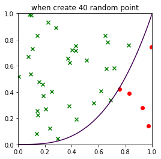

# Exercise for Monte Carlo Methods

## Exercise1: Generate an approximate value of Pi

使用蒙特卡洛方法求解 $\pi$ 时，采用均匀分布方法，取样点个数分别为50, 100, 200, 300, 500, 1000, 5000​，重复过程100次，然后记录每一次的值，求出均值与方差，样图与测试数据如下；([code](MC_Pi.py))

| 抽样点数 | 50       | 100      | 200      | 300      | 500      | 1000     | 5000     |
| -------- | -------- | -------- | -------- | -------- | -------- | -------- | -------- |
| 均值     | 3.040784 | 3.128317 | 3.141294 | 3.126246 | 3.137166 | 3.136783 | 3.139364 |
| 方差     | 0.058667 | 0.024641 | 0.014506 | 0.008849 | 0.005690 | 0.005690 | 0.000538 |

​                         

​                        

​                         

## Exercise2: Integrate the function $\int_0^1x^3dx$

蒙特卡洛方法求解定积分时，依旧使用随机均匀分布取点的方式进行，取点个数分别为5, 10, 20, 30, 40, 50, 60, 70, 80, 100​，重复过程100次；([code](MC_Intgration.py))

| 抽样点数 | 均值     | 方差     |
| -------- | -------- | -------- |
| 5        | 0.23000  | 0.028767 |
| 10       | 0.228182 | 0.016445 |
| 20       | 0.242857 | 0.009864 |
| 30       | 0.246452 | 0.006025 |
| 40       | 0.242927 | 0.004639 |
| 50       | 0.256078 | 0.003374 |
| 60       | 0.248197 | 0.003822 |
| 70       | 0.252817 | 0.003013 |
| 80       | 0.247654 | 0.002304 |
| 100      | 0.253069 | 0.001798 |

​                              

​                              

​			      

​                              

​                              

## Exercise3: Integrate the more difficult function 

**我们所要求解的积分方程为：**

### **$\int_{x=2}^4\int_{y=-1}^1\frac{y^2*e^{-y^2}+x^4*e^{-x^2}}{x*e^{-x^2}}$**

对于蒙特卡洛方法求解二重积分时，由于只知道两个维度上的取值范围，对于第三个维度的取值范围并不知道，所以采用前两题的方法求解时不太合理。若时要采用前两题的方法，则需要找到一个合适且足够大的立体与积分所对应的立体相比较；所以此时应采用平均值法，利用估算出来的面积取平均来作为积分估计的一个更好的近似值。在实现过程中发现，采样值为500时得到的结果并不是很好，所以尝试将抽样值取到10000，重复过程1000次，得到的结果最为接近。([code](MC_difIntgration.py))

| 抽样点数 | 均值          | 方差               |
| -------- | ------------- | ------------------ |
| 10       | 112765.598921 | 12293239324.089970 |
| 20       | 116118.512392 | 6251940987.006207  |
| 30       | 112825.607687 | 4145391383.871131  |
| 40       | 112334.019170 | 3325290425.315333  |
| 50       | 110708.140350 | 2433109610.269543  |
| 60       | 114001.327765 | 1944016440.805935  |
| 70       | 111952.136058 | 1603430574.863691  |
| 80       | 114233.151858 | 1641542470.779466  |
| 100      | 113868.354706 | 1209856204.501628  |
| 200      | 112825.610724 | 616923707.971396   |
| 500      | 112256.885687 | 242727711.703038   |
| 1000     | 113045.656993 | 125228836.227425   |
| 5000     | 112920.151711 | 24176471.987496    |
| 10000    | 112990.515652 | 13338883.074461    |