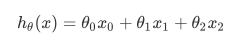
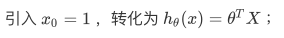
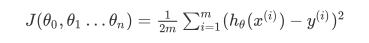
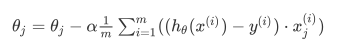
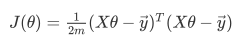
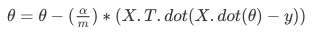
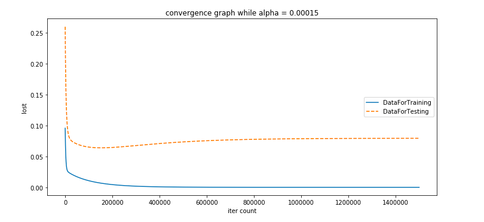
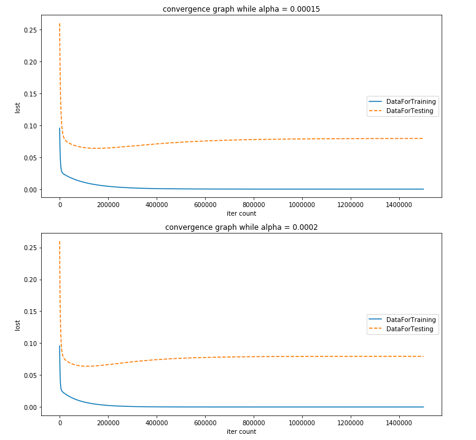
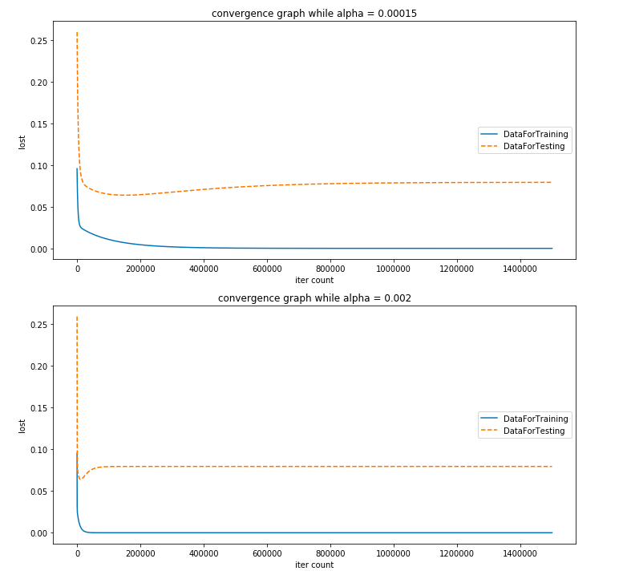
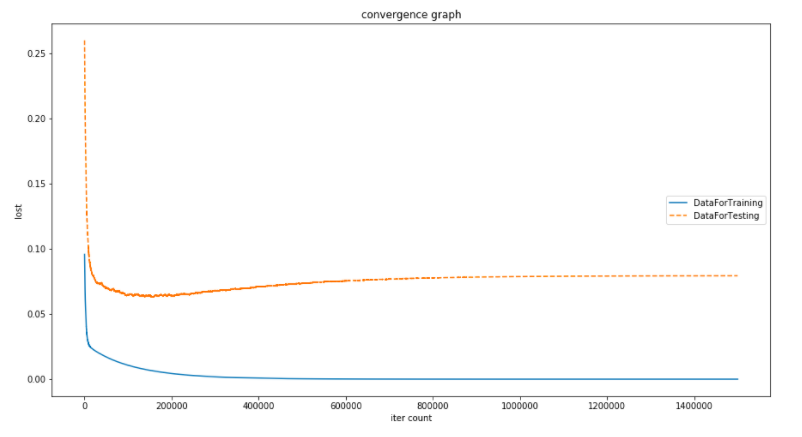

# Homework 2: Multivariate Linear Regression

## Exercise 1

对于所给的数据集，我们使用两个参数来进行训练，x1​ 和 x2 分别对应房子的面积和距离双鸭山职业技术学院的距离，可得出方程：

​								

 

数据加载是逐行读取，用空格切分，存储为 *np.array*​ 格式；为保证梯度下降算法更快地收敛，对数据进行缩放处理，此处我们使用 ​*sklearn.preprocessing.MinMaxScaler​* 类对数据归一化，将数据映射到（0，1）的范围；损失函数的计算通过计算损失平方和均值得到：

​								

```python
# 计算误差
def computeCost(X, y, theta):
    m = y.shape[0]
    J = (np.sum((X.dot(theta) - y)**2)) / (2*m)
    return J
```

其中 *theta* 的求解通过如下方程得到：

​								

为加快计算速度，可通过转化计算过程为向量话计算来实现，转化后损失函数可写为：

​								

则相应的 *theta* 的迭代为：

​								

 将 *alpha* 值设为0.00015，迭代1500000次，进行梯度下降模拟，实现如下：

```python 
# 梯度下降实现，X、y为训练集数据，X1、y1为测试集数据
# 学习率alpha = 0.00015，迭代次数num_iters = 1500000
def gradientDescent(X, y, X1, y1, theta, alpha, num_iters):
    m = y.shape[0]
    # 存储历史误差
    J_history = np.zeros((num_iters, 1)) # 初始化训练集历史误差
    J_history1 = np.zeros((num_iters,1)) # 初始化测试集历史误差
    for iter in range(num_iters):
        gradient = X.T.dot(X.dot(theta)-y)
        theta = theta - (alpha / m) * gradient
        J_history[iter] = computeCost(X, y, theta)
        # 使用训练集得来的theta，带入测试集数据
        J_history1[iter] = computeCost(X1, y1, theta)
    return J_history, J_history1, theta
```

| num_iters | J_history      | J_history1 |
| :-------- | -------------- | ---------- |
| 0         | 0.09566953     | 0.25976532 |
| 100000    | 0.01069353     | 0.06505139 |
| 200000    | 0.00436441     | 0.06446628 |
| 300000    | 0.00181569     | 0.06753992 |
| 400000    | 0.00076038     | 0.07081555 |
| 500000    | 0.00031982     | 0.07345639 |
| 600000    | 0.00013547     | 0.07538376 |
| 700000    | 5.82818471e-05 | 0.07672374 |
| 800000    | 2.59533782e-05 | 0.07763037 |
| 900000    | 1.24132207e-05 | 0.07823392 |
| 1000000   | 6.74209782e-06 | 0.07863165 |
| 1100000   | 4.36680957e-06 | 0.07889209 |
| 1200000   | 3.37194461e-06 | 0.07906191 |
| 1300000   | 2.95525555e-06 | 0.07917236 |
| 1400000   | 2.78072955e-06 | 0.07924407 |
| 1500000   | 2.70763156e-06 | 0.07929058 |

根据记录的历史误差值，作出下面的图像：



根据表格数据以及图像的直观反应，发现训练集误差的收敛值要小于测试集误差的收敛值，且测试集误差的收敛趋势是先降低又上升；

## Exercise 2

此时改变学习率 *alpha = 0.0002​*，再进行同样的运算，得到如下数据，下面的数据记录了迭代次数为0，100000，200000……1499999次时的历史误差，前两列为上一练习中学习率为0.00015时的历史误差数据，后两列为学习率为0.0002时的历史误差数据，发现学习率较大时，收敛速度更快，但在图像的反应上并不是非常明显；

```
[训练集]            [测试集]       [训练集]            [测试集]
[ 0.09566953]      [ 0.25976532] [ 0.09566032]      [ 0.25974846]
[ 0.01069353]      [ 0.06505139] [ 0.0079024]       [ 0.06398865]
[ 0.00436441]      [ 0.06446628] [ 0.00242968]      [ 0.06640763]
[ 0.00181569]      [ 0.06753992] [ 0.00076037]      [ 0.07081557]
[ 0.00076038]      [ 0.07081555] [ 0.00023994]      [ 0.07417359]
[ 0.00031982]      [ 0.07345639] [  7.70031182e-05] [ 0.07633258]
[ 0.00013547]      [ 0.07538376] [  2.59531930e-05] [ 0.07763038]
[  5.82818471e-05] [ 0.07672374] [  9.95599124e-06] [ 0.07838546]
[  2.59533782e-05] [ 0.07763037] [  4.94290782e-06] [ 0.07881728]
[  1.24132207e-05] [ 0.07823392] [  3.37193710e-06] [ 0.07906192]
[  6.74209782e-06] [ 0.07863165] [  2.87963502e-06] [ 0.07919979]
[  4.36680957e-06] [ 0.07889209] [  2.72536010e-06] [ 0.07927726]
[  3.37194461e-06] [ 0.07906191] [  2.67701427e-06] [ 0.07932072]
[  2.95525555e-06] [ 0.07917236] [  2.66186392e-06] [ 0.07934507]
[  2.78072955e-06] [ 0.07924407] [  2.65711619e-06] [ 0.07935872]
[  2.70763156e-06] [ 0.07929058] [  2.65494933e-06] [ 0.07937608]
```



尝试再次更改学习率 *alpha = 0.002​* ，进行同样的运算，记录数据如下（前两列*alpha = 0.00015*，后两列*alpha= 0.002*），下面的数据记录了迭代次数为0，100000，200000……1499999次时的历史误差，对比发现此时收敛速度比之前更快，对比更明显；

```
[训练集]            [测试集]       [训练集]            [测试集]
[ 0.09566953]      [ 0.25976532] [  0.09532924]     [ 0.25914214]
[ 0.01069353]      [ 0.06505139] [  2.87954351e-06] [ 0.07919982]
[ 0.00436441]      [ 0.06446628] [  2.65495138e-06] [ 0.07937555]
[ 0.00181569]      [ 0.06753992] [  2.65494933e-06] [ 0.07937608]
[ 0.00076038]      [ 0.07081555] [  2.65494933e-06] [ 0.07937608]
[ 0.00031982]      [ 0.07345639] [  2.65494933e-06] [ 0.07937608]
[ 0.00013547]      [ 0.07538376] [  2.65494933e-06] [ 0.07937608]
[  5.82818471e-05] [ 0.07672374] [  2.65494933e-06] [ 0.07937608]
[  2.59533782e-05] [ 0.07763037] [  2.65494933e-06] [ 0.07937608]
[  1.24132207e-05] [ 0.07823392] [  2.65494933e-06] [ 0.07937608]
[  6.74209782e-06] [ 0.07863165] [  2.65494933e-06] [ 0.07937608]
[  4.36680957e-06] [ 0.07889209] [  2.65494933e-06] [ 0.07937608]
[  3.37194461e-06] [ 0.07906191] [  2.65494933e-06] [ 0.07937608]
[  2.95525555e-06] [ 0.07917236] [  2.65494933e-06] [ 0.07937608]
[  2.78072955e-06] [ 0.07924407] [  2.65494933e-06] [ 0.07937608]
[  2.70763156e-06] [ 0.07929058] [  2.65494933e-06] [ 0.07937608]
```



## Exercise 3

对于样本量过大的数据集，采用随机梯度下降的方法能提高运算速度，这种方法每次迭代只使用一组样本数据进行 *theta* 值的更新，即每次随机出一组数据参与运算，而不用像**Ex.1**和**EX.2**那样，每次迭代时所有样本均参与一次计算;现在使用随机梯度下降的方式，学习率迭代次数不变，进行模拟，具体实现如下：

```python
#  theat 下降方向
def dj_sgd(theat, X, y):
    return X.T.dot(X.dot(theat)-y)

# 随机梯度下降实现，X、y为训练集数据，X1、y1为测试集数据
# 学习率alpha = 0.00015，迭代次数num_iters = 1500000
def gradientDescent(X, y, X1, y1, theta, alpha, num_iters):
    m = y.shape[0]
    # 存储历史误差
    J_history = np.zeros((num_iters, 1)) # 初始化训练集历史误差
    J_history1 = np.zeros((num_iters,1)) # 初始化测试集历史误差
    for iter in range(num_iters):
      	rand_i = np.random.randint(len(X))
        gradient = dj_sgd(theta, np.array([X[rand_i]]), np.array([y[rand_i]]))
        theta = theta - alpha * gradient 
        # 由于参与运算的只有一组样本，故此处不用再除以样本数量m
        J_history[iter] = computeCost(X, y, theta)
        # 使用训练集得来的theta，带入测试集数据
        J_history1[iter] = computeCost(X1, y1, theta)
    return J_history, J_history1, theta
```

收集数据如下，对比**EX.1**中的梯度下降方法，随机梯度下降在提高了运算速度的情况下依然能够保证收敛趋势；

```
[训练集]            [测试集]
[ 0.09565896]      [ 0.25974751]
[ 0.01068054]      [ 0.06461656]
[ 0.00435615]      [ 0.06420935]
[ 0.0018196]       [ 0.06781842]
[ 0.00075958]      [ 0.07108264]
[ 0.0003192]       [ 0.07340283]
[ 0.00013626]      [ 0.07534867]
[  5.84691014e-05] [ 0.07675526]
[  2.59411901e-05] [ 0.07761141]
[  1.23841278e-05] [ 0.07825227]
[  6.73296593e-06] [ 0.07862582]
[  4.35263948e-06] [ 0.07888495]
[  3.36720027e-06] [ 0.07904713]
[  2.95648267e-06] [ 0.07918798]
[  2.78203450e-06] [ 0.07923039]
[  2.70766048e-06] [ 0.07928182]
```

根据下面的图像可以看出，误差在下降并收敛时（迭代次数在50000-600000之间），数据一直有小的波动，可以体现随机梯度下降时的过程；



对比在**EX.1** 得到的误差图，整体趋势上变化不大.


